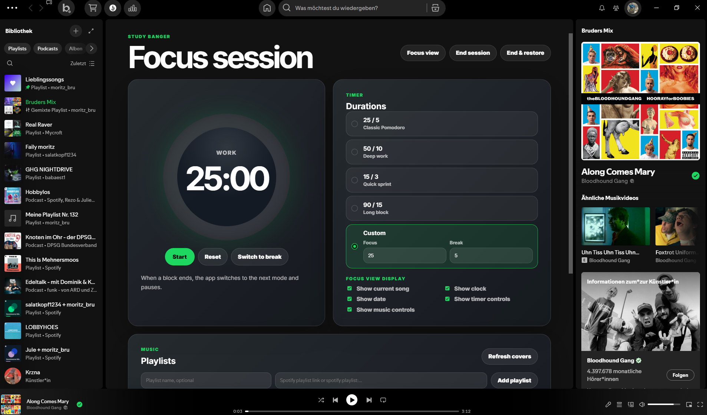
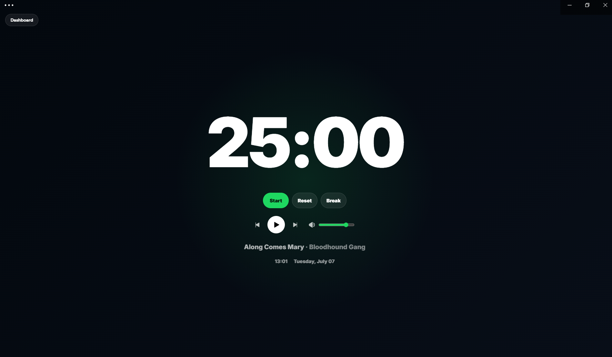
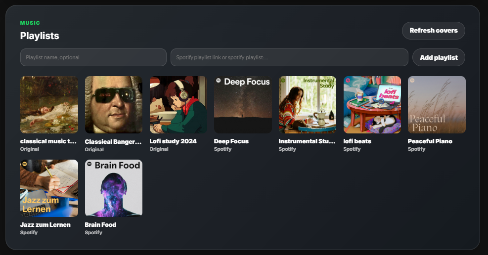

# Study Banger

Study Banger is a Spicetify custom app for focused study and work sessions. It combines a configurable focus timer with Spotify playlist playback and a clean fullscreen Focus View.

<p align="center">
  
  
  
</p>

## Features

- Focus and break timer with presets
- Custom focus and break durations
- Dashboard for setup, timer settings, and playlist selection
- Fullscreen Focus View for distraction-free sessions
- Optional Focus View elements:
  - current song
  - 24-hour clock
  - date
  - timer controls
  - music controls
- Spotify playback controls in Focus View
- Default study playlists included
- Custom playlists via Spotify playlist URL or `spotify:playlist:...` URI
- Generated fallback covers when playlist artwork is unavailable
- Best-effort restore of previous playback when ending a session

## Installation

### Release ZIP

1. Download the latest `study-banger` release ZIP.
2. Open your Spicetify config folder:

```powershell
spicetify config-dir
```

3. Open the `CustomApps` folder.
4. Extract the release ZIP into `CustomApps`.

After extracting, the folder should look like this:

```text
CustomApps/
└── study-banger/
    ├── extension.js
    ├── index.js
    ├── manifest.json
    └── style.css
```

5. Enable the custom app:

```powershell
spicetify config custom_apps study-banger
spicetify apply
```

6. Restart Spotify.

Study Banger should now appear in Spotify.

### Build from source

For development or local changes, build the app manually:

```powershell
npm install
npm run build-local
```

Then copy the generated files from `dist/` into:

```text
CustomApps/study-banger/
```

Enable and apply the app:

```powershell
spicetify config custom_apps study-banger
spicetify apply
```

## Usage

1. Open Study Banger in Spotify.
2. Choose a timer preset or set custom focus and break durations.
3. Pick a playlist or add your own Spotify playlist.
4. Start the timer.
5. Use Focus View for a clean fullscreen timer.
6. Return to the dashboard with the `Dashboard` button or `Escape`.

When a focus or break block ends, the app switches to the next mode and pauses. Press `Start` to begin the next block.

## Uninstall

Remove Study Banger from the Spicetify config:

```powershell
spicetify config custom_apps study-banger-
spicetify apply
```

Then delete the app folder:

```text
CustomApps/study-banger/
```

Restart Spotify afterwards.

## Screenshots

Screenshots are stored in:

```text
docs/screenshots/
```

Included screenshots:

```text
dashboard.png
focus-view.png
playlists.png
```

## Contributing

Please read [CONTRIBUTING.md](CONTRIBUTING.md) before opening a pull request.

## Code of Conduct

Please read [CODE_OF_CONDUCT.md](CODE_OF_CONDUCT.md) before contributing.

## License

This project is available under the [MIT License](LICENSE).
